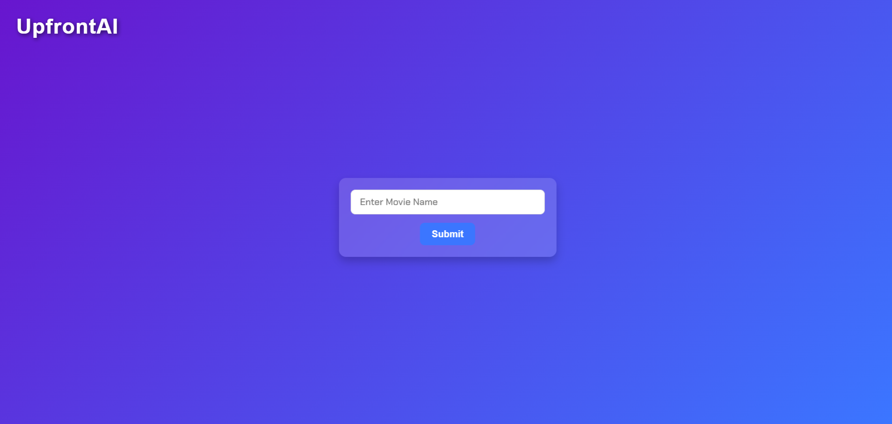
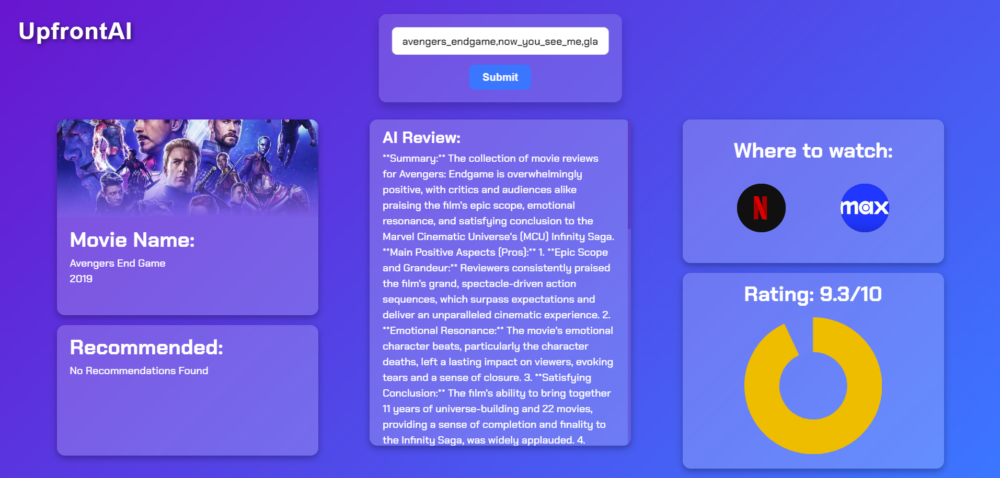

# UpfrontAI

UpfrontAI is an innovative serverless application designed to assist users in comparing movies based on ratings, prices, and other metrics developed for the geekathon2024. By leveraging state-of-the-art AI techniques such as Retrieval-Augmented Generation (RAG), prompt engineering, and large language models (LLMs), UpfrontAI provides insightful summaries and scores for movies based on reviews so you do not waste time scrolling through all the reviews!

---

## Features

### 🎥 Movie Review Analysis
- Summarizes critic and audience reviews to provide clear, actionable insights.
- Highlights pros, cons, and overall sentiment for each movie.

### 📊 Advanced Scoring System
- **Quality Score:** Analyzes review content and summaries for relevance.
- **Price Score:** Balances ratings and hypothetical price ranges.
- **Sentiment Score:** Evaluates sentiment expressed in reviews using keyword analysis.

### 🏆 Best Movie Selector
- Automatically compares movies and identifies the one with the best overall score.

### 🔎 Web Scraping
- Extracts reviews directly from Rotten Tomatoes using BeautifulSoup.

### 💡 AI-Powered Summaries
- Leverages AWS Bedrock Runtime with Meta Llama 3 to generate professional-quality summaries and ratings.

---

## How It Works

1. **Review Collection:**
   - Scrapes reviews for selected movies from Rotten Tomatoes (critic and audience).

2. **Summary Generation:**
   - Uses AI to craft detailed summaries and ratings based on storytelling, acting, visuals, and direction.

3. **Scoring System:**
   - Combines Quality, Price, and Sentiment Scores to evaluate each movie.

4. **Comparison & Selection:**
   - Determines the best movie based on scores and provides detailed feedback.

---

## Tech Stack

### Backend
- Python
- AWS Lambda for API handling
- BeautifulSoup for web scraping
- AWS Bedrock Runtime for AI integration

### Frontend
- React (typescript) + CSS
- Responsive UI for user-friendly experience

### AI Models
- Meta Llama 3 for summarization
- Custom algorithms for scoring and analysis

### The Future Enhancements
- Include support for TV shows and additional media formats.
- Enable personalized recommendations using user profiles.
- Expand data sources for a broader range of reviews.
- Enhance scoring algorithms with advanced ML models.
---

## 📱 Screenshots

<p align="center">
  
  
</p>


## Installation

### Prerequisites
- Python 3.8+
- Node.js and npm
- AWS account with Bedrock Runtime access

### Backend Setup

1. Clone the repository:
   ```bash
   git clone https://github.com/your-repo/revaiwer.git
   cd revaiwer/backend


## How to run app

### Run the app

To run the application, follow these steps:

```bash
cd front_end
npm install
npm run dev
```


License
This project is licensed under the MIT License. Feel free to use and modify the application.

Contact
For inquiries, reach out to Afonso Carvalho or Diogo Gouveia.
